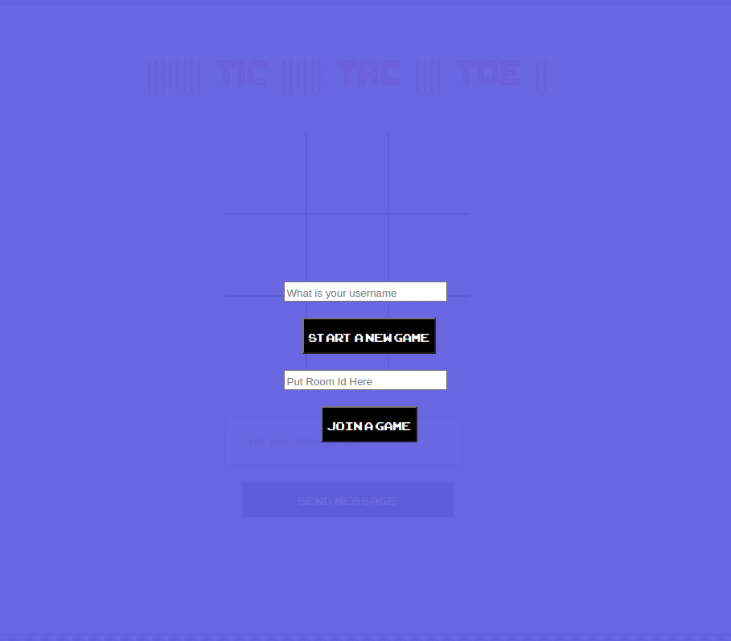
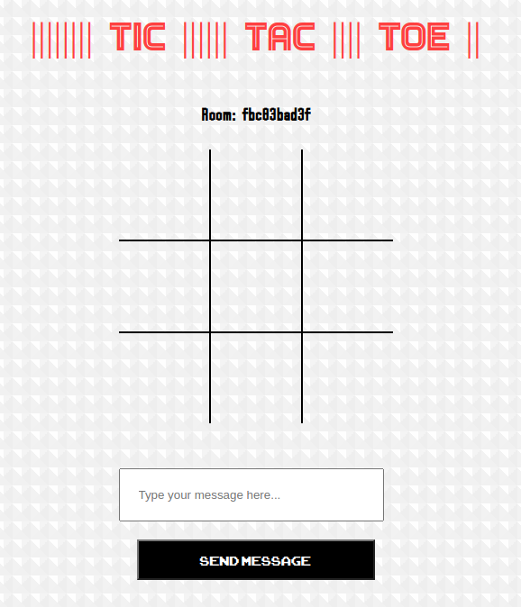

# Multiplayer Tic-Tac-Toe

I used the good old game tic-tac-toe game to learn how to use SocketIo by creating a multiplayer version of the game.

## Set Up The App

```bash
python -m venv tic_tac_toe
source tic_tac_toe/bin/activate
pip install -r requirements.txt
```

### Start The Game

<br>
Users asked to either start a new game or put in the 10 room ID of an existing game to join a game.  
<br>
The room ID appears on top of the page and can be used to join to the room.
<br><br>


<br><br>

### Chat Function

<br>
The game is also a mini chat app which users can write messages to each other.
<br><br>

